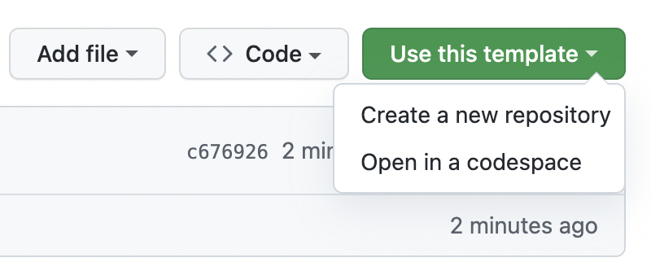

# DevOps Engineer Assignment

Welcome! This assignment is designed to assess your DevOps skills through practical, hands-on tasks that reflect modern cloud-native development practices.

## Table of Contents

- [DevOps Engineer Assignment](#devops-engineer-assignment)
  - [Table of Contents](#table-of-contents)
  - [Overview](#overview)
  - [Getting Started](#getting-started)
    - [create the repo](#create-the-repo)
    - [Prerequisites](#prerequisites)
    - [Local environment Setup](#local-environment-setup)
  - [Assignment Tasks](#assignment-tasks)
    - [Task 1: Documentation \& AI Usage](#task-1-documentation--ai-usage)
    - [Task 2: Infrastructure as Code (IaC)](#task-2-infrastructure-as-code-iac)
    - [Task 3: Application Containerization](#task-3-application-containerization)
    - [Task 4: CI/CD Pipeline](#task-4-cicd-pipeline)
    - [Task 5: Kubernetes Deployment](#task-5-kubernetes-deployment)
    - [Task 6: Writing a script](#task-6-writing-a-script)
  - [How to Submit](#how-to-submit)

## Overview

You'll be working with a **Task Management REST API** built with Spring Boot and PostgreSQL. The application is fully implemented - your focus will be on containerizing it, deploying it to Kubernetes with proper database integration, setting up CI/CD pipelines, and demonstrating modern DevOps practices. The entire assignment can be completed locally on your machine.

## Getting Started

### create the repo

Create a repository based on this template repo. Make sure it's a **private** repo.



### Prerequisites

Ensure you have the following installed on your machine:

- **Docker**
- **Kubectl**
- **Git**

### Local environment Setup

#### Setting up k3d on linux

```bash
## use package manager of choice, arch for instance:
yay -s rancher-k3d-bin

## Or use the install script:
curl -s https://raw.githubusercontent.com/k3d-io/k3d/main/install.sh | bash
```

#### Setting up k3d on macos

```bash
# Install k3d on macos:
brew install k3d
```

#### Cluster creation

```bash
# Create a local cluster
k3d cluster create devops-assignment --agents 1 --port "8080:80@loadbalancer"

# Verify cluster is running
kubectl cluster-info
kubectl get nodes
```

After performing these steps you are ready to start the assignment.

---

## Assignment Tasks

### Task 1: Documentation & AI Usage

1. **Fill in [`AI_assistance_log.md`](AI_assistance_log.md) and [`decision_log.md`](decision_log.md)** documenting:
   - How you made use of AI for solving this assignment
   - What tools were used
   - Decisions that you made during the assignment.

---

### Task 2: Infrastructure as Code (IaC)

1. **Cluster Setup:**
   - Provision your k3d cluster using the CLI (as shown in the Getting Started section)
   - Ensure the cluster is running and accessible via kubectl

2. **Deploy a GitOps tool using Terraform:**
   - Use Terraform with the Helm provider to deploy either **ArgoCD** or **Flux** to your cluster.
   - Choose one GitOps tool and justify your choice in your documentation
   - Configure the tool appropriately for local development
   - Ensure the tool is accessible (via port-forward or ingress)

3. **Document your setup** in a README within the `iac/` directory:
   - Prerequisites (Terraform version, required providers, kubectl access)
   - Your choice of GitOps tool and reasoning
   - How to set up kubeconfig for Terraform
   - How to access the GitOps tool UI
   - How to verify resources are created in the cluster

---

### Task 3: Application Containerization

The `taskapi/` directory contains a fully implemented Spring Boot REST API. **Your task is to create a proper Dockerfile to containerize it.**

1. **Create a `Dockerfile`** that:
   - **Uses multi-stage builds** (build stage with JDK + runtime stage with JRE)
   - Builds the application using: `./gradlew clean build`
   - Exposes port 8080
   - **Includes a HEALTHCHECK instruction** using `/actuator/health`
   - Optimizes layer caching (copy gradle files before source)
   - Follows Docker best practices

---

### Task 4: CI/CD Pipeline

1. **Create a CI workflow** (e.g., `.github/workflows/ci.yml`) that:
   - Builds the Docker image
   - Pushes the image to GitHub Container Registry
   - Tags images appropriately

---

### Task 5: Kubernetes Deployment

1. **Create your deployment configuration**
   - Create a Helm chart in the `k8s/` directory (or a subdirectory)
   - Do not use plain manifests alone, leverage the features of Helm
   - Structure your chart to support multiple environments (dev, acc, prd)
   - Include both the Task API application and PostgreSQL database

2. **Application Deployment Specifications:**
   - Design your deployment for high availability, reliability, and efficient resource usage
   - Implement health checks (liveness and readiness probes) using `/actuator/health/liveness` and `/actuator/health/readiness`
   - Configure environment variables for database connectivity

3. **Database Deployment:**
   - Deploy PostgreSQL in Kubernetes
   - Implement persistent storage using PersistentVolumeClaims
   - Use Secrets for database credentials  
   - Use ConfigMaps for database initialization (if needed)
   - Ensure proper initialization order (database before application)

---

### Task 6: Writing a script

The Sunrise Sunset website at [https://sunrise-sunset.org/api](https://sunrise-sunset.org/api) provides a REST API to retrieve sunrise and sunset times for a specific location using coordinates. We would like to have a script that shows when we need to turn the lights in the office on or off. Our office is located in the Netherlands (in the CET or CEST time zone), at the following latitude and longitude:

| Latitude  | Longitude |
|-----------|-----------|
| 50.930581 | 5.780691  |

The office lights should be on between sunset and sunrise, and off between sunrise and sunset.
Use information returned from the API call to determine whether the lights should be on or off at the time of script execution.
Your script should return nothing more or less than the word `ON` or `OFF`.
Make sure to test edge cases, i.e. around the sunrise and sunset times, with and without daylight savings, and around midnight.
To accomplish this task, the choice of programming language and/or framework is yours.
If you installed additional tools to build and test your script, please show how you did this in your solution too.

---

## How to Submit

1. **Commit your code.**
2. **Push all changes to the main branch of your repository.**
3. **Install our [github app](https://github.com/apps/ilionx-assignment-grader) in your repository**.
4. **Send an email towards your contact at Ilionx.**
